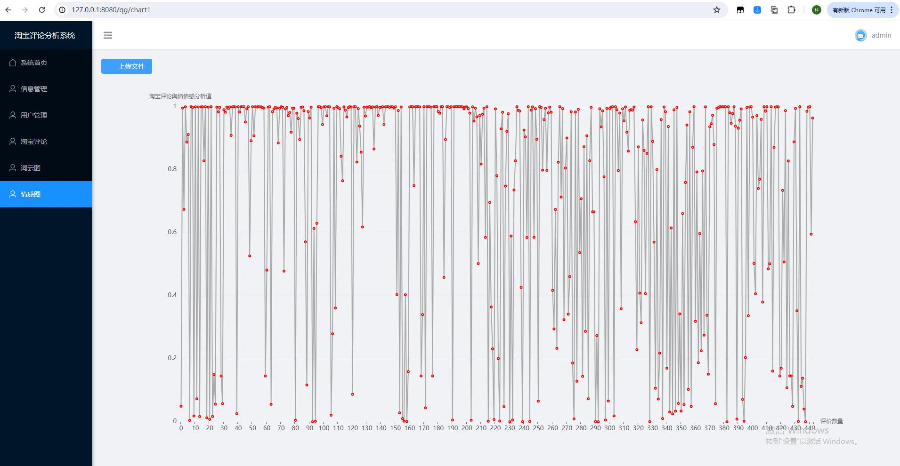

# 基于django+vue淘宝京东商品评论舆情分析系统情感分析系统


**如果自己下载源码后遇到问题无法解决（前后端衔接、报错、找不到文件位置，不知道怎么修改，想简单修改做毕设，想简单修改给别人做毕设）等问题都可以联系作者微信：python_kk或者qq：976870170（备注github，不备注不通过）**


### 运行截图


登录


注册


首页


用户管理


淘宝评论和情感分析预测值


词云图


情感值分析折线图




词云图上传结果


情感图上传结果


后端部分代码


前端部分代码


### 功能介绍

- 爬虫功能：通过python的selenium库对淘宝评论进行定时抓取，保存文件中
- django：通过处理上传来的文件进行解析整理，分词，去除停用词，得到词频，解析情感，保存文件中
- vue：通过调用后台登录注册、用户、淘宝评论、词云图、情感分析图接口显示对应数据


#### 后端运行步骤

cd backend

pip install -r utils/requirement.txt

python manage.py runserver 127.0.0.1:8000


#### 前端运行步骤


进入front目录下，安装依赖，执行:

```
npm install 
```

```
npm run dev
```

localhost:8080可以访问


需要指导联系微信：python_kk
